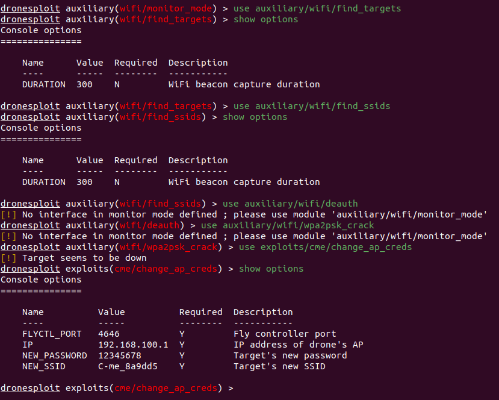
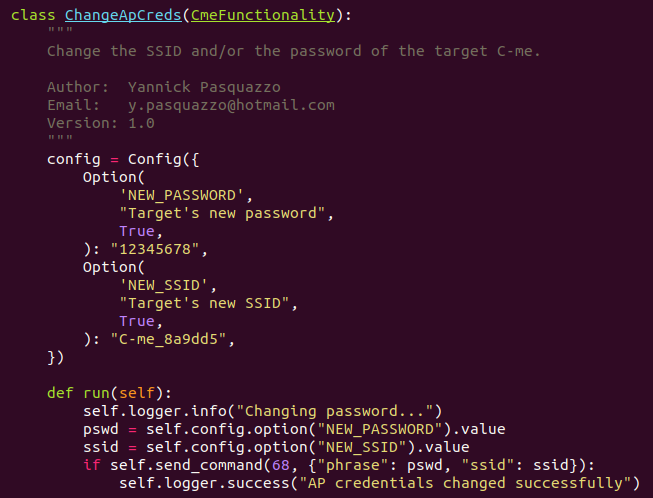

# DroneSploit

This CLI framework is based on [`sploitkit`](https://github.com/dhondta/sploitkit) and is an attempt to gather hacking techniques and exploits especially focused on **drone hacking**. For the ease of use, the interface has a layout that looks like Metasploit.

[Black Hat Europe Arsenal 2019 presentation](docs/blackhat-eu19-arsenal.pdf)

Also see: [Article on *The Daily Swig*](https://portswigger.net/daily-swig/black-hat-europe-new-tool-offers-metasploit-like-framework-for-hacking-into-drones)

# Basics

## Interface

## Modules

This example shows an example of module for DroneSploit aimed to change the password or the SSID of a particular model of drone.

