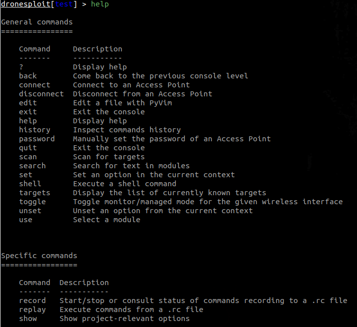
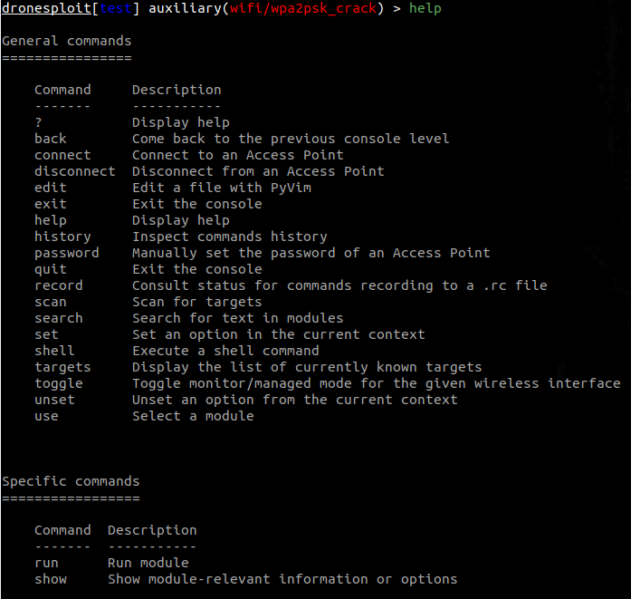
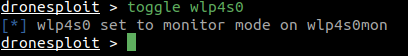
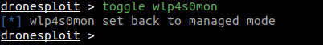
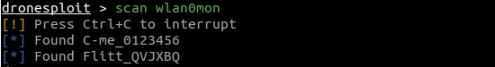
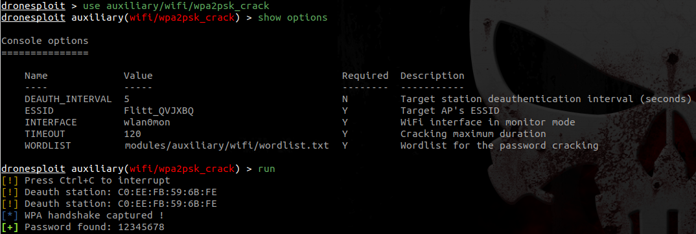
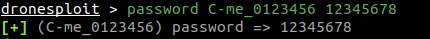
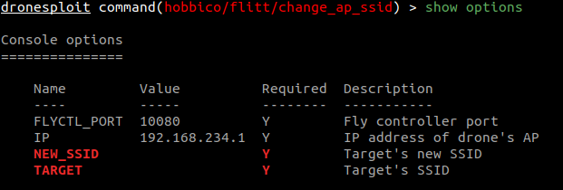
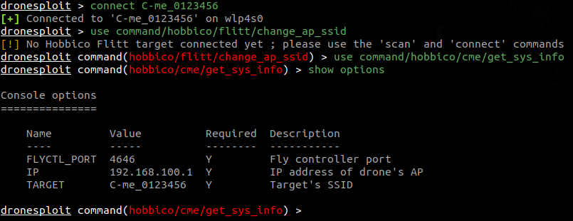
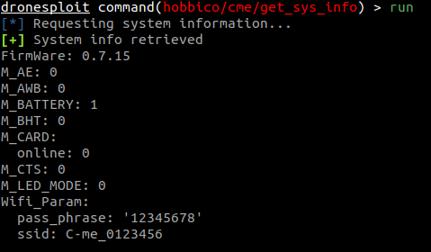

# Quick Start

## 1. Startup

At startup, a banner and the numbers of available modules are shown.


!!! note "Disabled modules"
    
    Some requirements can be unsatisfied at startup like in the picture above. The command `show issues` allows to identify how this can be fixed.

## 2. Getting help

**2.1 From the root console**

```bash
dronesploit > help
[...]
```

This will display multiple sections in function of the context ;

- General commands are always displayed

    ??? example "**Example**: Getting help in DroneSploit - General commands"
        
        

    <br>

- Level-specific commands are displayed according to the current console

    ??? example "**Example**: Getting help in DroneSploit - Specific commands"
        
        

    <br>

**2.2 From the project console**

```bash
dronesploit > select test
dronesploit[test] > help
[...]
```

Now being into the context of a project, we now see the general commands again but with the project commands as the section for level-specific commands ;

??? example "**Example**: Getting help in DroneSploit - Project-level commands"
    
    

<br>

**2.3 From the module console**

```bash
dronesploit[test] > use auxiliary/wifi/deauth
dronesploit[test] auxiliary(wifi/deauth) > help
[...]
```

Now being into the context of a module, we now see the general commands again but with the module commands as the section for level-specific commands ;

??? example "**Example**: Getting help in DroneSploit - Module-level commands"
    
    

<br>

## 3. Listing available modules

This can be achieved by executing the following command :


!!! note "Disabled modules"
    
    In the screenshot above, one can see two modules that are disabled, like shown at startup.

## 4. Enabling the WiFi monitor mode

The `toggle` command allows to toggle the WiFi mode for an interface. It autocompletes through the list of WiFi interfaces present on the system.



When executed, it switches between the managed and monitor modes.



## 5. Scanning for targets

The `scan` command allows to quickly scan for targets (and requires a WiFi interface in monitor mode).



The `targets` command then allows to list the discovered targets and their characteristics.


!!! warning "Scanning"
    
    For WiFi drones, the `scan` command only searches for drone targets based on regular expressions, meaning that the matching SSID's are those which are handled by the [related filter](https://github.com/dhondta/dronesploit/blob/main/dronesploit/wifi/drone.py). Any other SSID is ignored, so do not be scared if you see no result and there is no drone turned on in the vicinity ; this is normal.

!!! note "Targets expiration"
    
    Targets are valid during a period of 5 minutes, meaning that they will still be displayed after this period, but when using the `scan` command again, the list will be updated (and targets that are not in the vicinity anymore will disappear).

## 6. Breaking into a target

Now that we have a target, we can start an attack. For this purpose, we start the appropriate attack module. Note that, in the example hereafter, the `ESSID` and `INTERFACE` options are automatically filled in with the current information.



The attack succeeded and the password is then known in the targets list.


Sadly, lots of light commercial drones have the same default password ; the `password` command allows to fill in the password without having to run an attack.



## 7. Connecting to the target

At this point, we have a password for a target, we can know connect to it using the `connect` command.


!!! note "Target connected highlighted in the list"
    
    Like shown in the screenshot above, the targets list has now a row highlighted in bold to show that we are connected to this target.

We can also connect to another target.


!!! note "Warning while calling a module"
    
    In the case herebefore, we call a module for which the required model of target can not be found as connected to the attack machine, therefore raising a warning. If we show the options for this module, we get several required values that are not filled in.
    
    

## 8. Executing a module

We can now use a module for the connected drone using the `use` command.



!!! note "Options auto-completion"
    
    In this example, one can see that the value for the `TARGET` option is automatically filled in. The module is then directly ready to run.

Finally, we can run the module by using the `run` command.


