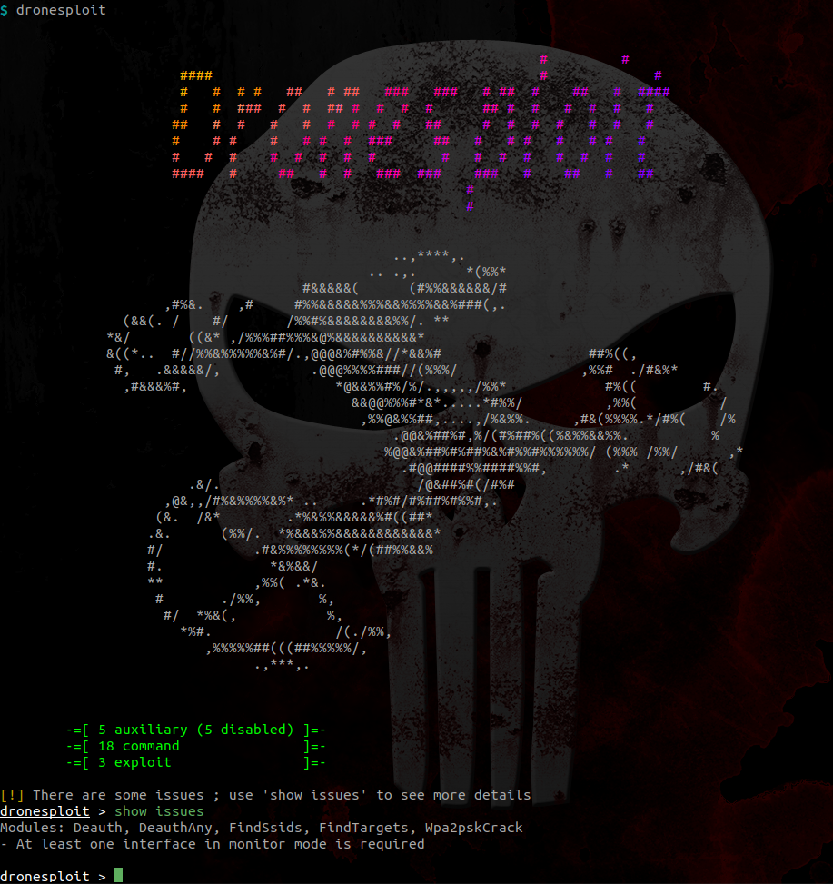
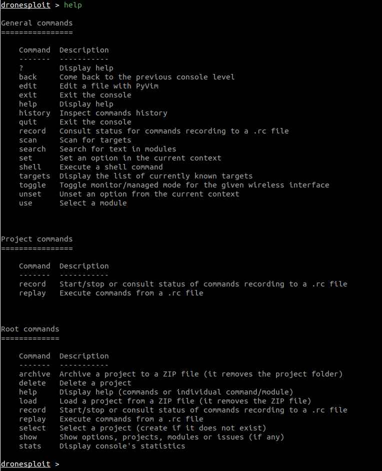
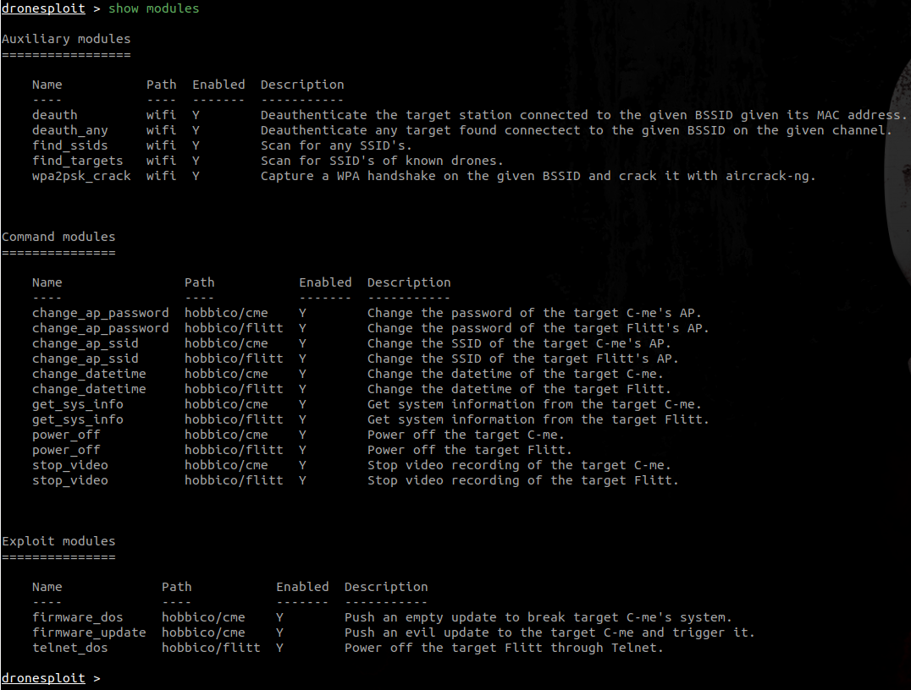

## 1. Startup

```bash
$ python3 main.py --help
usage: ./main.py [--dev] [-h] [-v]

Main

optional arguments:
  --dev          development mode (default: False)

extra arguments:
  -h, --help     show this help message and exit
  -v, --verbose  verbose mode (default: False)
```

The console is started using the launcher `main.py`. It may ask for sudo rights as it must have the permission for setting WiFi interfaces.

```bash
$ python3 main.py
[sudo] password for user:

[...]
```

At startup, a banner is shown and a summary of the available modules is shown.



!!! note "Disabled modules"
    
    Some requirements can be unsatisfied at startup like in the picture above. The command `show issues` allows to identify how this can be fixed.

## 2. Getting help



## 3. Listing available modules



!!! note "Disabled modules"
    
    In the screenshot above, one can see two modules that are disabled, like shown at startup.

## 4. Enabling the WiFi monitor mode

The `toggle` command allows to toggle the WiFi mode for an interface. It autocompletes through the list of WiFi interfaces present on the system.


When executed, it switches between the managed and monitor modes.


## 5. Scanning for targets

The `scan` command allows to quickly scan for targets (and requires a WiFi interface in monitor mode).

## 6. Breaking into a target

Now that we have a target, we can start an attack. For this purpose, we start the appropriate attack module :


## 7. Using modules to control the target
